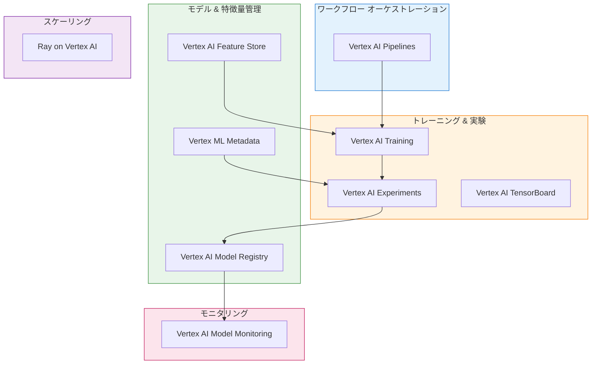

# Vertex AI MLOps サンプルコード

このリポジトリでは、Vertex AI の各 MLOps サービスに関するサンプルコードを提供しています。

## MLOps とは

モデルのデプロイ後、モデルは環境内のデータの変化に対応して、最適なパフォーマンスを発揮し、妥当性を維持する必要があります。**MLOps** は ML システムの安定性と信頼性を向上させる一連の手法です。

Vertex AI MLOps ツールは、予測モデルのモニタリング、アラート、診断、実用的な説明を通じて、AI チーム間のコラボレーションとモデルの改善を支援します。すべてのツールはモジュール式であるため、必要に応じて既存システムに統合できます。

> 詳細については、[ML における継続的デリバリーと自動化のパイプライン](https://cloud.google.com/architecture/mlops-continuous-delivery-and-automation-pipelines-in-machine-learning)と [MLOps の実践ガイド](https://cloud.google.com/resources/mlops-whitepaper)をご覧ください。

## Vertex AI MLOps サービス一覧



### ワークフロー オーケストレーション

| サービス | 説明 |
|---------|------|
| **[Vertex AI Pipelines](https://cloud.google.com/vertex-ai/docs/pipelines)** | ML ワークフローの自動化、モニタリング、管理を容易にします。手動でのトレーニングと提供は時間がかかりエラーが発生しやすいため、パイプラインによる自動化が重要です。 |

### トレーニング & 実験

| サービス | 説明 |
|---------|------|
| **[Vertex AI Training](https://cloud.google.com/vertex-ai/docs/training)** | ML ライフサイクル全体に適合するコンピューティングオプションを備えたフルマネージドサービス。試験運用にはサーバーレス、大規模ワークロードには予約済みクラスタを使用可能。 |
| **[Vertex AI Experiments](https://cloud.google.com/vertex-ai/docs/experiments)** | さまざまなモデルアーキテクチャ、ハイパーパラメータ、トレーニング環境を追跡・分析し、ユースケースに最適なモデルを特定。 |
| **[Vertex AI TensorBoard](https://cloud.google.com/vertex-ai/docs/experiments/tensorboard-introduction)** | ML テストの追跡、可視化、比較を行い、モデルのパフォーマンスを測定。 |

### モデル & 特徴量管理

| サービス | 説明 |
|---------|------|
| **[Vertex AI Model Registry](https://cloud.google.com/vertex-ai/docs/model-registry)** | モデルの概要を確認し、新しいバージョンの整理、追跡、トレーニングを実施。エンドポイントへのデプロイやバッチ推論の作成も可能。 |
| **[Vertex AI Feature Store](https://cloud.google.com/vertex-ai/docs/featurestore)** | ML の特徴を整理、保存、提供するための一元化されたリポジトリ。組織全体で特徴を再利用し、新しい ML アプリケーションの開発・デプロイ時間を短縮。 |
| **[Vertex ML Metadata](https://cloud.google.com/vertex-ai/docs/ml-metadata)** | ML システムで使用されるメタデータ、パラメータ、アーティファクトを記録。クエリを実行してパフォーマンスの分析、デバッグ、監査が可能。 |

### モニタリング

| サービス | 説明 |
|---------|------|
| **[Vertex AI Model Monitoring](https://cloud.google.com/vertex-ai/docs/model-monitoring)** | トレーニング-サービングスキューと推論ドリフトをモニタリング。入力データがトレーニングデータから外れた場合にアラートを送信し、再トレーニングの必要性を評価。 |

### スケーリング

| サービス | 説明 |
|---------|------|
| **[Ray on Vertex AI](https://cloud.google.com/vertex-ai/docs/open-source/ray-on-vertex-ai)** | AI と Python アプリケーションをスケーリングするための Ray フレームワークを Vertex AI 上で実行。分散コンピューティングと並列処理を実現。 |

## セットアップ

### 1. 設定ファイルの作成

テンプレートから設定ファイルを作成します：

```bash
cd vertexai-mlops
cp config.yaml.template config.yaml
```

### 2. 設定ファイルの編集

`config.yaml` を編集し、プロジェクト ID とバケット名を設定します：

```yaml
project_id: "your-actual-project-id"
location: "asia-northeast1"

gcs:
  bucket: "your-actual-bucket-name"
  pipeline_root: "gs://your-actual-bucket-name/pipeline-root"
  staging_bucket: "gs://your-actual-bucket-name/staging"
```

### 3. 認証

```bash
gcloud auth application-default login
```

## サンプルコード

このリポジトリでは、上記の Vertex AI MLOps サービスについて、実践的なサンプルコードを提供しています。

| ディレクトリ | 対象サービス | 説明 |
|-------------|-------------|------|
| [pipelines-sample/](./pipelines-sample/) | Vertex AI Pipelines | KFP SDK を使用した ML パイプラインのサンプル |
| [experiments-sample/](./experiments-sample/) | Vertex AI Experiments | 実験追跡とメトリクス記録のサンプル |
| [featurestore-sample/](./featurestore-sample/) | Vertex AI Feature Store | Feature Monitoring によるドリフト検出のサンプル |

## 参考リンク

- [Vertex AI ドキュメント](https://cloud.google.com/vertex-ai/docs)
- [MLOps: ML における継続的デリバリーと自動化のパイプライン](https://cloud.google.com/architecture/mlops-continuous-delivery-and-automation-pipelines-in-machine-learning)
- [MLOps の実践ガイド](https://cloud.google.com/resources/mlops-whitepaper)
