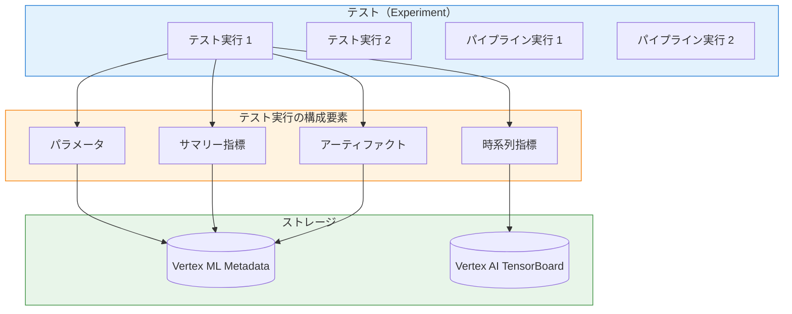
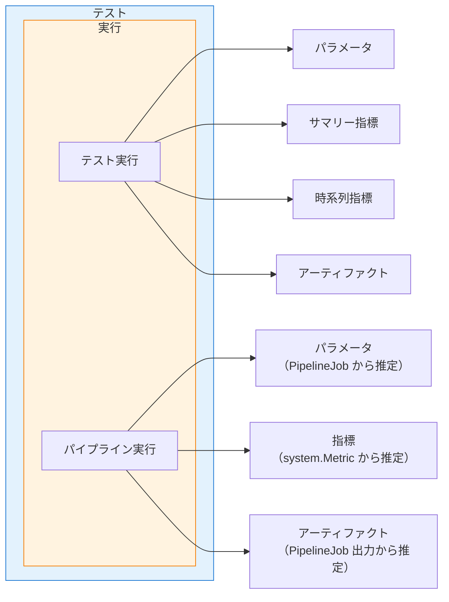
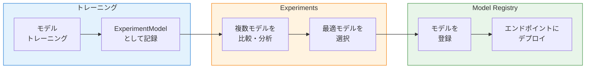
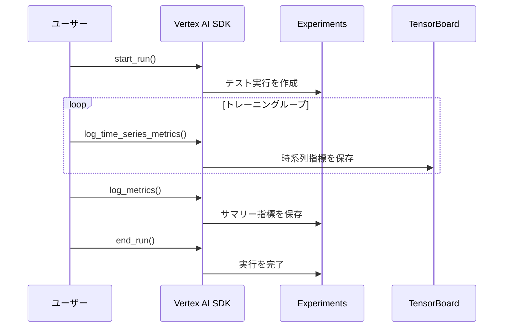

# Vertex AI Experiments アーキテクチャ

## 概要

Vertex AI Experiments は、ML 開発における実験追跡・管理のためのサービスです。テスト実行の手順、入力（パラメータ、データセット）、出力（モデル、指標）を体系的に追跡し、複数のモデルやパイプライン実行を比較・分析できます。

> **ポイント**: Vertex AI Experiments は Vertex ML Metadata のコンテキストとして実装されており、アーティファクトのリネージ追跡と連携しています。

---

## アーキテクチャ



### データモデル

Vertex AI Experiments のデータモデルは階層構造になっています。



---

## 主要コンセプト

### テスト（Experiment）

テストは、複数のテスト実行やパイプライン実行をグループ化するコンテキストです。

| 項目 | 説明 |
|-----|------|
| 目的 | 入力アーティファクトやハイパーパラメータなどの構成をグループとして調査 |
| 構成要素 | n 個のテスト実行 + n 個のパイプライン実行 |
| 識別子 | 一意のテスト名（例: `ml-training-experiment`） |

```python
from google.cloud import aiplatform

# テストを作成
aiplatform.init(project="PROJECT_ID", location="asia-northeast1")

experiment = aiplatform.Experiment.create(
    experiment_name="my-experiment",
    description="ハイパーパラメータ最適化実験",
)
```

### テスト実行（Experiment Run）

テスト内の特定の追跡可能な実行です。入出力をロギングし、ML 開発のイテレーションをモニタリング・比較します。

| 項目 | 説明 |
|-----|------|
| パラメータ | アルゴリズム、ハイパーパラメータ、データセットパスなど |
| サマリー指標 | 各指標キーの単一値（例: 最終的なテスト精度） |
| 時系列指標 | トレーニング中の指標推移（Vertex AI TensorBoard に保存） |
| アーティファクト | モデル、チェックポイント、データセットなど |

```python
# テスト実行を開始
with aiplatform.start_run("run-001") as run:
    # パラメータをログ
    run.log_params({
        "learning_rate": 0.01,
        "epochs": 100,
        "batch_size": 32,
    })

    # トレーニング処理...

    # サマリー指標をログ
    run.log_metrics({
        "accuracy": 0.95,
        "f1_score": 0.92,
    })
```

### パイプライン実行（Pipeline Run）

Vertex AI PipelineJob をテストに関連付けた実行です。

| 項目 | 説明 |
|-----|------|
| パラメータ | PipelineJob のパラメータから自動推定 |
| 指標 | `system.Metric` アーティファクトから自動推定 |
| アーティファクト | PipelineJob が生成したアーティファクトから自動推定 |

```python
# パイプラインをテストに関連付けて実行
job = aiplatform.PipelineJob(
    display_name="ml-training-pipeline",
    template_path="pipeline.yaml",
    pipeline_root="gs://bucket/root",
)

job.submit(experiment="my-experiment")
```

---

## 指標の種類

### サマリー指標

テスト実行の各指標キーに対する単一の値です。

| 用途 | 例 |
|-----|-----|
| モデル評価 | テスト精度、F1 スコア、AUC |
| トレーニング結果 | 最終損失値、収束エポック数 |
| データ統計 | サンプル数、特徴量数 |

```python
# サマリー指標をログ
run.log_metrics({
    "test_accuracy": 0.95,
    "test_f1_score": 0.92,
    "test_precision": 0.94,
    "test_recall": 0.93,
})
```

### 時系列指標

トレーニング過程における指標値の推移です。Vertex AI TensorBoard に保存されます。

| 用途 | 例 |
|-----|-----|
| 学習曲線 | エポックごとの損失・精度 |
| 収束監視 | バッチごとの勾配ノルム |
| リソース使用 | ステップごとの GPU 使用率 |

```python
# 時系列指標をログ（トレーニングループ内）
for epoch in range(100):
    train_loss = train_one_epoch()
    val_loss = validate()

    run.log_time_series_metrics({
        "train_loss": train_loss,
        "val_loss": val_loss,
    }, step=epoch)
```

---

## アーティファクトの種類

Vertex AI Experiments では、スキーマを使用してアーティファクトのタイプを定義します。

| スキーマタイプ | 説明 | 例 |
|--------------|------|-----|
| `system.Dataset` | データセット | トレーニングデータ、テストデータ |
| `system.Model` | 学習済みモデル | SavedModel、joblib ファイル |
| `system.Metrics` | 評価指標 | 精度、損失値 |
| `system.Artifact` | 汎用アーティファクト | 設定ファイル、ログ |

```python
# アーティファクトをログ
run.log_artifact(
    artifact=aiplatform.Artifact.create(
        schema_title="system.Model",
        display_name="trained-model",
        uri="gs://bucket/models/model.joblib",
    )
)
```

---

## モデルのシリアル化と Model Registry 連携

モデルを追跡、共有、分析できるように、Vertex AI SDK for Python には ML モデルを `ExperimentModel` クラスにシリアル化し、Vertex AI Experiments に記録する API が用意されています。使用する最適なモデルを選択したら、Vertex AI Experiments から Vertex AI Model Registry にモデルを登録できます。

### サポートされているフレームワーク

| フレームワーク | サポート状況 | 保存形式 |
|--------------|------------|---------|
| **scikit-learn** | ✅ | joblib / pickle |
| **XGBoost** | ✅ | JSON / binary |
| **TensorFlow** | ✅ | SavedModel |

### ExperimentModel の基本的な使い方

```python
from google.cloud import aiplatform

aiplatform.init(
    project="PROJECT_ID",
    location="asia-northeast1",
    experiment="my-experiment",
)

# テスト実行を開始
with aiplatform.start_run("run-001") as run:
    # モデルをトレーニング
    from sklearn.ensemble import RandomForestClassifier
    model = RandomForestClassifier(n_estimators=100)
    model.fit(X_train, y_train)

    # モデルを ExperimentModel として記録
    experiment_model = aiplatform.log_model(
        model=model,
        artifact_id="trained-model",
        uri="gs://bucket/models/",  # モデルの保存先
        input_example=X_train[:5],  # オプション: 入力サンプル
    )
```

### Model Registry への登録

Experiments で最適なモデルを選択したら、Model Registry に登録してデプロイ可能にします。

```python
# ExperimentModel から Model Registry に登録
registered_model = experiment_model.register_model(
    display_name="my-production-model",
    description="ベストパフォーマンスのモデル",
)

print(f"登録されたモデル: {registered_model.resource_name}")
```

### ワークフロー全体図



### フレームワーク別の例

#### scikit-learn

```python
from sklearn.ensemble import GradientBoostingClassifier
from google.cloud import aiplatform

aiplatform.init(project="PROJECT_ID", location="asia-northeast1", experiment="sklearn-exp")

with aiplatform.start_run("sklearn-run") as run:
    model = GradientBoostingClassifier(n_estimators=100, max_depth=5)
    model.fit(X_train, y_train)

    # パラメータと指標をログ
    run.log_params({"n_estimators": 100, "max_depth": 5})
    run.log_metrics({"accuracy": model.score(X_test, y_test)})

    # モデルを記録
    exp_model = aiplatform.log_model(
        model=model,
        artifact_id="sklearn-model",
        uri="gs://bucket/sklearn-models/",
    )

    # Model Registry に登録
    registered = exp_model.register_model(display_name="sklearn-classifier")
```

#### XGBoost

```python
import xgboost as xgb
from google.cloud import aiplatform

aiplatform.init(project="PROJECT_ID", location="asia-northeast1", experiment="xgboost-exp")

with aiplatform.start_run("xgboost-run") as run:
    dtrain = xgb.DMatrix(X_train, label=y_train)
    params = {"max_depth": 6, "eta": 0.3, "objective": "binary:logistic"}
    model = xgb.train(params, dtrain, num_boost_round=100)

    run.log_params(params)

    # モデルを記録
    exp_model = aiplatform.log_model(
        model=model,
        artifact_id="xgboost-model",
        uri="gs://bucket/xgboost-models/",
    )
```

#### TensorFlow

```python
import tensorflow as tf
from google.cloud import aiplatform

aiplatform.init(project="PROJECT_ID", location="asia-northeast1", experiment="tf-exp")

with aiplatform.start_run("tf-run") as run:
    model = tf.keras.Sequential([
        tf.keras.layers.Dense(128, activation='relu'),
        tf.keras.layers.Dense(1, activation='sigmoid')
    ])
    model.compile(optimizer='adam', loss='binary_crossentropy', metrics=['accuracy'])
    model.fit(X_train, y_train, epochs=10)

    # モデルを記録（SavedModel 形式）
    exp_model = aiplatform.log_model(
        model=model,
        artifact_id="tf-model",
        uri="gs://bucket/tf-models/",
    )

    # Model Registry に登録
    registered = exp_model.register_model(display_name="tf-classifier")
```

---

## ユースケース

### 1. モデルのトレーニング追跡



### 2. モデル・パイプラインの比較

複数のテスト実行やパイプライン実行を並べて比較し、最適なモデルを選択します。

| 比較項目 | 確認できる内容 |
|---------|--------------|
| パラメータ | ハイパーパラメータの違い |
| 指標 | 各モデルの精度・性能 |
| アーティファクト | 使用したデータセット・生成モデル |

### 3. パフォーマンス分析

トレーニング中のモデルパフォーマンスを追跡・評価します。

- 特定のモデルが全体的にどの程度機能しているか
- どこがうまく機能しないか
- モデルのどこが優れているか

---

## サポート範囲

### 対応環境

| 環境 | サポート状況 |
|-----|------------|
| Vertex AI カスタムトレーニング | ✅ 完全サポート |
| Vertex AI Workbench ノートブック | ✅ 完全サポート |
| Colab / ローカル環境 | ✅ SDK 経由でサポート |

### 対応 ML フレームワーク

| フレームワーク | 統合レベル |
|--------------|----------|
| TensorFlow | 緊密統合（自動ログ対応） |
| PyTorch | SDK 経由 |
| scikit-learn | SDK 経由 |
| XGBoost | SDK 経由 |

> **注意**: TensorFlow では、Vertex AI Experiments がフレームワークと緊密に統合されており、多くの指標が自動的にログされます。

---

## 自動ログ機能（autolog）

`aiplatform.autolog()` は、ML フレームワークのトレーニング処理を自動的に追跡する機能です。

### autolog が有効なケース

| ケース | 説明 | autolog の効果 |
|-------|------|---------------|
| **カスタムトレーニングジョブ** | Vertex AI Training で実行するスクリプト | パラメータ・指標を自動記録 |
| **ノートブック開発** | Workbench / Colab での対話的開発 | 実験の手動ログを省略 |
| **ローカル開発** | ローカル環境でのモデル開発 | SDK 経由で Experiments に記録 |

### 基本的な使い方

```python
from google.cloud import aiplatform

# Experiments を初期化
aiplatform.init(
    experiment="my-experiment",
    project="PROJECT_ID",
    location="asia-northeast1",
    experiment_tensorboard="projects/PROJECT_ID/locations/LOCATION/tensorboards/TB_ID",  # オプション
)

# autolog を有効化
aiplatform.autolog()

# ここでモデルをトレーニング
# TensorFlow / sklearn / PyTorch / XGBoost など
model.fit(X_train, y_train)

# autolog を無効化
aiplatform.autolog(disable=True)
```

### フレームワーク別の自動記録内容

| フレームワーク | パラメータ | 指標 | モデル |
|--------------|----------|------|-------|
| **TensorFlow/Keras** | optimizer, epochs, batch_size など | loss, accuracy, val_loss など | SavedModel |
| **scikit-learn** | estimator パラメータ | score（該当する場合） | joblib |
| **XGBoost** | max_depth, learning_rate など | eval_metric | モデルファイル |
| **PyTorch** | 手動設定が必要 | 手動設定が必要 | 手動設定が必要 |

### TensorFlow での例

```python
import tensorflow as tf
from google.cloud import aiplatform

aiplatform.init(
    experiment="tensorflow-experiment",
    project="PROJECT_ID",
    location="asia-northeast1",
)

aiplatform.autolog()

# Keras モデルを構築
model = tf.keras.Sequential([
    tf.keras.layers.Dense(128, activation='relu'),
    tf.keras.layers.Dense(10, activation='softmax')
])

model.compile(
    optimizer='adam',
    loss='sparse_categorical_crossentropy',
    metrics=['accuracy']
)

# fit() を呼び出すと自動的に以下が記録される:
# - パラメータ: epochs, batch_size, optimizer など
# - 時系列指標: loss, accuracy, val_loss, val_accuracy
model.fit(X_train, y_train, epochs=10, validation_split=0.2)

aiplatform.autolog(disable=True)
```

### scikit-learn での例

```python
from sklearn.ensemble import RandomForestClassifier
from google.cloud import aiplatform

aiplatform.init(
    experiment="sklearn-experiment",
    project="PROJECT_ID",
    location="asia-northeast1",
)

aiplatform.autolog()

# モデルを構築・トレーニング
# 自動的にパラメータ（n_estimators, max_depth など）が記録される
model = RandomForestClassifier(n_estimators=100, max_depth=10)
model.fit(X_train, y_train)

aiplatform.autolog(disable=True)
```

### autolog が無効なケース

| ケース | 理由 | 代替手段 |
|-------|------|---------|
| **Vertex AI Pipelines** | 各コンポーネントが独立 Pod で実行 | `job.submit(experiment=...)` |
| **分散トレーニング** | 複数ワーカー間の調整が必要 | 手動ログ |
| **カスタム指標** | 自動記録対象外の指標 | `run.log_metrics()` |

> **注意**: Vertex AI Pipelines では `autolog()` は動作しません。パイプライン実行を Experiments に関連付ける場合は、`job.submit(experiment="experiment-name")` を使用してください。

---

## Vertex AI Pipelines との連携

### パイプライン実行をテストに関連付ける

```python
from google.cloud import aiplatform

aiplatform.init(
    project="PROJECT_ID",
    location="asia-northeast1",
)

job = aiplatform.PipelineJob(
    display_name="ml-training-pipeline",
    template_path="pipeline.yaml",
    pipeline_root="gs://bucket/root",
    parameter_values={
        "learning_rate": 0.01,
        "epochs": 100,
    },
)

# experiment パラメータでテストに関連付け
job.submit(experiment="my-experiment")
```

### 自動推定される情報

| 情報 | 推定元 |
|-----|-------|
| パラメータ | `PipelineJob.parameter_values` |
| 指標 | パイプラインが生成した `system.Metrics` アーティファクト |
| アーティファクト | パイプラインが生成したすべてのアーティファクト |

### 本サンプルでの設定

[config.yaml](../pipeline-sample/config/config.yaml) で Experiments 連携を設定できます。

```yaml
experiments:
  enabled: true
  experiment_name: "ml-training-experiment"
  description: "ML Training Pipeline の実験追跡"
```

コマンドラインでの切り替え:

```bash
# Experiments 連携を有効にして実行
python run_pipeline.py --pipeline ml_training --experiment

# Experiments 連携を無効にして実行
python run_pipeline.py --pipeline ml_training --no-experiment
```

---

## Cloud Console での操作

### テストの表示

1. Cloud Console → Vertex AI → Experiments
2. リージョンを選択
3. テスト名をクリック

### 確認できる情報

| タブ | 内容 |
|-----|------|
| 概要 | テストの基本情報、実行一覧 |
| 実行 | 各実行のパラメータ・指標 |
| 比較 | 複数実行の並列比較 |
| リネージ | アーティファクトの来歴 |

### 実行の比較

1. 複数の実行にチェックを入れる
2. **[比較]** をクリック
3. パラメータと指標を並べて確認

---

## API リファレンス

### テストの作成・管理

```python
from google.cloud import aiplatform

# テストを作成
experiment = aiplatform.Experiment.create(
    experiment_name="my-experiment",
    description="実験の説明",
)

# 既存のテストを取得
experiment = aiplatform.Experiment("my-experiment")

# テスト一覧を取得
experiments = aiplatform.Experiment.list()

# テストを削除
experiment.delete()
```

### テスト実行の作成・管理

```python
# テスト実行を開始（コンテキストマネージャー）
with aiplatform.start_run("run-001") as run:
    run.log_params({"param1": "value1"})
    run.log_metrics({"metric1": 0.95})

# 手動でテスト実行を管理
run = aiplatform.ExperimentRun.create(
    run_name="run-002",
    experiment="my-experiment",
)
run.log_params({"param1": "value1"})
run.end_run()

# 実行一覧を取得
runs = aiplatform.ExperimentRun.list(experiment="my-experiment")
```

### 指標・パラメータのログ

```python
# パラメータをログ
run.log_params({
    "learning_rate": 0.01,
    "batch_size": 32,
    "optimizer": "adam",
})

# サマリー指標をログ
run.log_metrics({
    "accuracy": 0.95,
    "loss": 0.05,
})

# 時系列指標をログ
run.log_time_series_metrics(
    {"train_loss": 0.1, "val_loss": 0.15},
    step=10,
)
```

---

## ベストプラクティス

| 項目 | 推奨事項 |
|-----|---------|
| 命名規則 | テスト名・実行名は一貫した命名規則を使用 |
| パラメータログ | 再現性のため、すべてのハイパーパラメータをログ |
| 指標の粒度 | 重要な指標は必ずサマリー指標として記録 |
| アーティファクト管理 | モデル・データセットは `system.*` スキーマで分類 |
| 整理 | 不要になったテスト・実行は定期的に削除 |

---

## 参考リンク

- [Vertex AI Experiments ドキュメント](https://cloud.google.com/vertex-ai/docs/experiments/intro-vertex-ai-experiments)
- [テストを作成する](https://cloud.google.com/vertex-ai/docs/experiments/create-experiment)
- [テスト実行を作成して管理する](https://cloud.google.com/vertex-ai/docs/experiments/create-run)
- [パイプラインをテストに関連付ける](https://cloud.google.com/vertex-ai/docs/experiments/associate-pipeline-run)
