# Vertex AI Feature Store 全体像

## 目次

- [新規 Vertex AI Feature Store](#新規-vertex-ai-feature-store)
  - [全体アーキテクチャ](#全体アーキテクチャ)
  - [主要コンポーネント一覧](#主要コンポーネント一覧)
  - [特徴サマリー](#特徴サマリー)
- [コンポーネント詳細](#コンポーネント詳細)
  - [1. 特徴レジストリ](#1-特徴レジストリ)
  - [2. オンライン サービング](#2-オンライン-サービング)
  - [3. メタデータとガバナンス](#3-メタデータとガバナンス)
  - [4. 特徴量モニタリング](#4-特徴量モニタリング)
  - [5. エンベディングの管理とベクトル検索](#5-エンベディングの管理とベクトル検索)
- [Vertex AI Feature Store（従来版）](#vertex-ai-feature-store従来版)
- [アーキテクチャ比較サマリー](#アーキテクチャ比較サマリー)

---

## 新規 Vertex AI Feature Store

### 全体アーキテクチャ

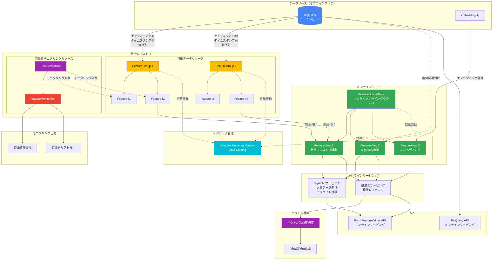

### 主要コンポーネント一覧

| コンポーネント                   | 説明                                                                                           |
| -------------------------------- | ---------------------------------------------------------------------------------------------- |
| **BigQuery（オフラインストア）** | 特徴データのソース。別途オフラインストアのプロビジョニング不要                                 |
| **特徴レジストリ**               | FeatureGroup / Feature でデータソースを登録。FeatureMonitor / FeatureMonitorJob でモニタリング |
| **オンラインストア**             | FeatureOnlineStore / FeatureView でオンラインサービングを構成                                  |
| **オンラインサービング**         | Bigtable（大量データ向け）と最適化（超低レイテンシ向け）の 2 種類                              |
| **ベクトル検索**                 | 最適化サービングでエンベディング管理・近似最近傍検索をサポート                                 |
| **メタデータ管理**               | Dataplex Universal Catalog（Data Catalog）と統合                                               |

### 特徴サマリー

- **BigQuery がオフラインストア**: 別途オフラインストアのプロビジョニング不要
- **データ同期**: BigQuery から最新の特徴値のみをオンラインストアにコピー
- **2 種類のオンラインサービング**:
  - Bigtable: 大量データ（テラバイト規模）向け
  - 最適化: 超低レイテンシ向け
- **特徴レジストリ**: FeatureGroup で BigQuery データソースを登録
- **ベクトル検索**: エンベディング管理と近似最近傍検索をサポート
- **メタデータ管理**: Dataplex Universal Catalog と統合してガバナンス機能を提供

---

## コンポーネント詳細

以下では、各コンポーネントの詳細を説明します。

### 1. 特徴レジストリ

BigQuery でデータソースを準備したら、それらのデータソース（特定の特徴列を含む）を特徴レジストリに登録できます。

> **注意**: 特徴の登録は任意です。BigQuery データソースを特徴レジストリに追加しなくても、オンラインで特徴を提供できます。

ただし、以下のような場合は特徴を登録したほうが便利です：

| ユースケース                   | 説明                                                                                                                                                                                                                                   |
| ------------------------------ | -------------------------------------------------------------------------------------------------------------------------------------------------------------------------------------------------------------------------------------- |
| **重複エンティティ ID の処理** | データに同じエンティティ ID のインスタンスが複数含まれている場合、タイムスタンプ列を含む時系列形式でデータを準備する必要があります。特徴を登録すると、Vertex AI Feature Store がタイムスタンプを検索し、最新の特徴値のみを提供します。 |
| **特定列の選択的登録**         | データソースから特定の特徴列のみを登録したい場合                                                                                                                                                                                       |
| **複数データソースの集約**     | 複数のデータソースから特定の列を集計して、特徴ビューのインスタンスを定義したい場合                                                                                                                                                     |
| **特徴ドリフト検出**           | 特徴統計情報をモニタリングして特徴ドリフトを検出したい場合                                                                                                                                                                             |

#### 特徴レジストリのリソース

特徴レジストリには、次の 2 種類の Vertex AI Feature Store リソースがあります：

1. **特徴データの特徴レジストリ リソース**
2. **特徴量モニタリング用の特徴レジストリ リソース**

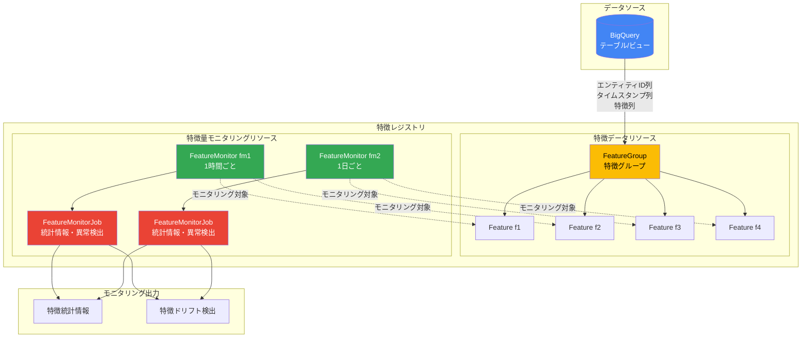

#### 特徴データの特徴レジストリ リソース

特徴データを特徴レジストリに登録するには、次の Vertex AI Feature Store リソースを作成する必要があります。

| リソース                         | 説明                                                                                                                                                                                                                                                            |
| -------------------------------- | --------------------------------------------------------------------------------------------------------------------------------------------------------------------------------------------------------------------------------------------------------------- |
| **特徴グループ（FeatureGroup）** | 特定の BigQuery ソーステーブルまたはビューに関連付けられるリソース。Feature リソースで表される特徴列の論理グループです。特徴レコードを識別する 1 つ以上のエンティティ ID 列を含みます。特徴データが時系列形式の場合は、タイムスタンプ列も含める必要があります。 |
| **特徴（Feature）**              | 親の FeatureGroup リソースに関連付けられている特徴データソースの特徴値を含む特定の列を表すリソース。                                                                                                                                                            |

**図: BigQuery データソースをソースとする 2 つの Feature 列を含む FeatureGroup の例**

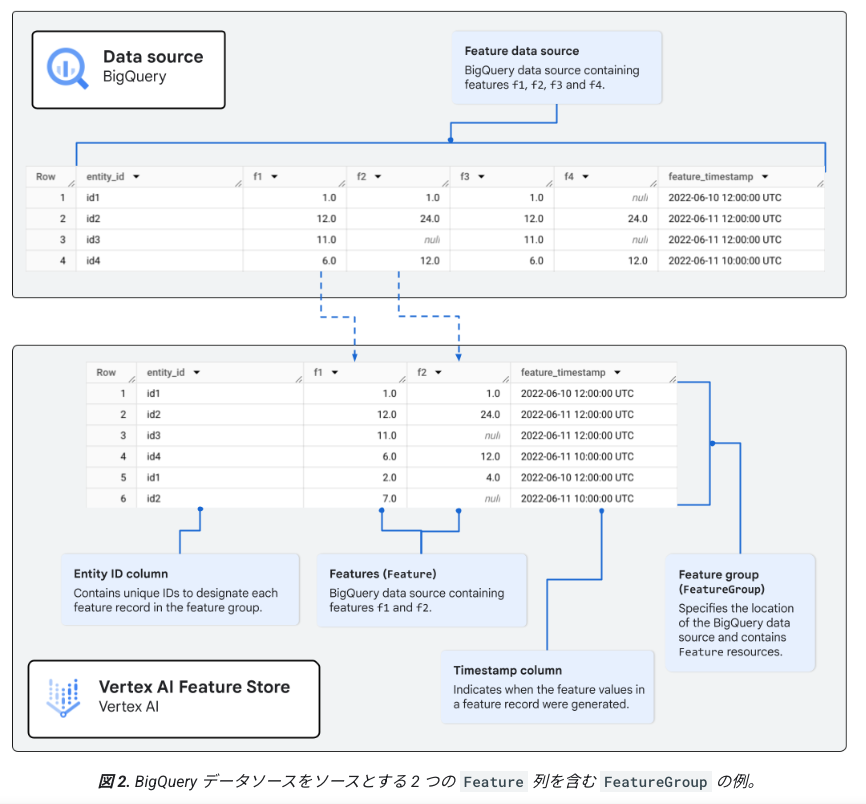

上図は特徴列 f1 と f2 を含む特徴グループを表しています。特徴グループに関連付けられた BigQuery テーブルがソースになっています。BigQuery データソースに 4 つの特徴列があり、2 つの列を集計して特徴グループを形成しています。特徴グループには、エンティティ ID 列と特徴のタイムスタンプ列も含まれています。

#### 特徴量モニタリング用の特徴レジストリ リソース

特徴量モニタリング リソースを使用すると、FeatureGroup リソースと Feature リソースを使用して登録された特徴データをモニタリングできます。

| リソース                                    | 説明                                                                                                                                                                                                                                               |
| ------------------------------------------- | -------------------------------------------------------------------------------------------------------------------------------------------------------------------------------------------------------------------------------------------------- |
| **特徴モニター（FeatureMonitor）**          | FeatureGroup リソースとその特徴グループ内の 1 つ以上の特徴に関連付けられるリソース。モニタリングのスケジュールを指定します。複数の特徴モニター リソースを作成して、特徴グループ内の同じ特徴セットに異なるモニタリング スケジュールを設定できます。 |
| **特徴モニタージョブ（FeatureMonitorJob）** | 特徴量モニタリング ジョブの実行時に取得された特徴統計情報と情報を含むリソース。特徴データで検出された異常（特徴ドリフトなど）に関する情報も含まれます。                                                                                            |

**特徴モニターの設定例:**

更新頻度が異なる特徴がある場合、複数の特徴モニターを作成して効率的にモニタリングできます：

| 特徴モニター | 対象特徴 | スケジュール |
| ------------ | -------- | ------------ |
| fm1          | f1, f2   | 1 時間ごと   |
| fm2          | f3, f4   | 1 日ごと     |

### 2. オンライン サービング

オンライン予測に特徴を提供するには、少なくとも 1 つのオンライン サービング クラスタを定義して構成し、特徴データソースまたは特徴レジストリ リソースに関連付ける必要があります。Vertex AI Feature Store では、オンライン サービング クラスタを**オンライン ストア インスタンス**と呼んでいます。オンライン ストア インスタンスには複数の特徴ビューが含まれている場合があります。その場合、それぞれの特徴ビューが特徴データソースと関連付けられています。

#### オンライン サービング リソース

オンライン サービングを設定するには、次の Vertex AI Feature Store リソースを作成する必要があります。

| リソース                                    | 説明                                                                                                                                                                                                                                                                                                                                         |
| ------------------------------------------- | -------------------------------------------------------------------------------------------------------------------------------------------------------------------------------------------------------------------------------------------------------------------------------------------------------------------------------------------- |
| **オンライン ストア（FeatureOnlineStore）** | オンライン サービング クラスタ インスタンスを表すリソース。オンライン サービング ノードの数など、オンライン サービスの構成が含まれます。オンライン ストア インスタンスには特徴データのソースが指定されていませんが、BigQuery または特徴レジストリのいずれかで特徴データソースを特定できる FeatureView リソースが含まれている必要があります。 |
| **特徴ビュー（FeatureView）**               | オンライン ストア インスタンスにある特徴の論理的なコレクション。特徴ビューを作成するときに、特徴データソースの場所を指定します。                                                                                                                                                                                                             |

#### 特徴ビューのデータソース指定方法

特徴ビューを作成する際、以下のいずれかの方法で特徴データソースの場所を指定できます：

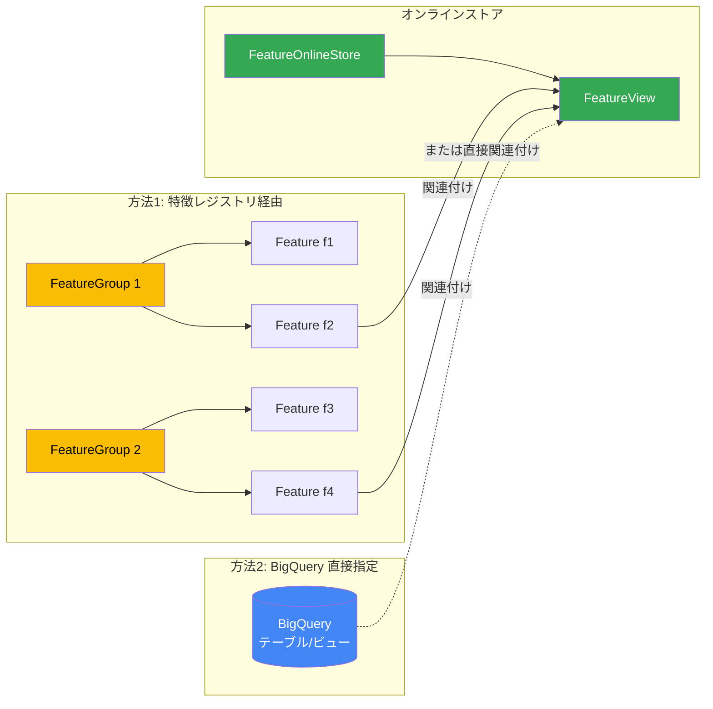

| 方法                           | 説明                                                                                                                                                                         |
| ------------------------------ | ---------------------------------------------------------------------------------------------------------------------------------------------------------------------------- |
| **特徴レジストリから関連付け** | 1 つ以上の特徴グループと特徴を関連付けます。特徴グループは BigQuery データソースのロケーションを示し、特徴グループ内の特徴はそのデータソース内の特定の特徴列を指しています。 |
| **BigQuery 直接指定**          | BigQuery のソーステーブルまたはビューを直接関連付けます。                                                                                                                    |

**図: 2 つの個別の機能グループの特徴を含む FeatureView の例**

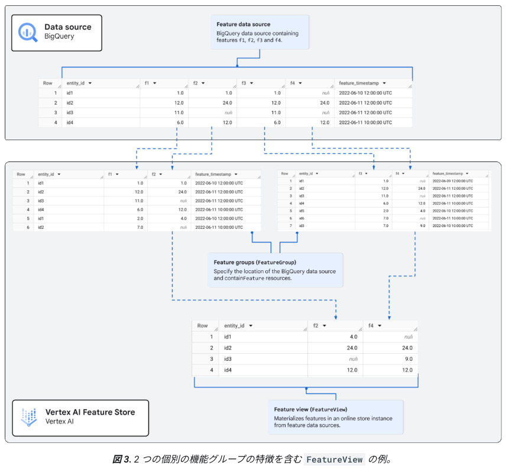

上図は特徴列 f2 と f4 を含む特徴ビューを示しています。これらの特徴列は、BigQuery テーブルに関連付けられた 2 つの別々の特徴グループをソースとしています。

### 3. メタデータとガバナンス

Vertex AI Feature Store は **Dataplex Universal Catalog** と統合され、特徴メタデータなど、特徴のガバナンス機能を提供します。

#### Data Catalog 連携

オンライン ストア インスタンス、特徴ビュー、特徴グループは Data Catalog にデータアセットとして自動的に登録されます。

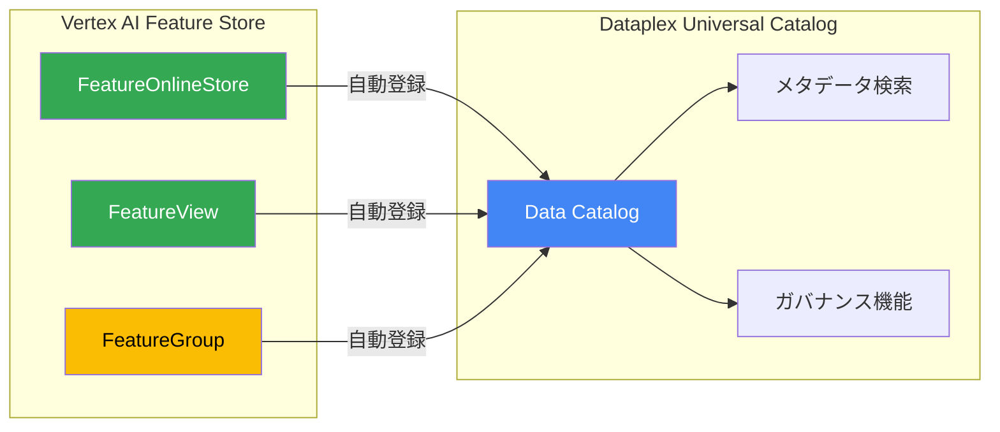

| 機能                       | 説明                                                                          |
| -------------------------- | ----------------------------------------------------------------------------- |
| **メタデータのカタログ化** | Data Catalog がリソースからメタデータをカタログ化                             |
| **メタデータ検索**         | Dataplex Universal Catalog の検索機能でリソースのメタデータを検索・表示・管理 |

#### 特徴ラベル

リソースの作成中または作成後に、リソースにラベルを追加できます。

#### リソース バージョン メタデータ

Vertex AI Feature Store では、特徴のバージョン **0 のみ**がサポートされます。

### 4. 特徴量モニタリング

Vertex AI Feature Store では、特徴モニタリング ジョブをスケジュールして実行し、特徴データをモニタリングして統計情報を取得し、特徴ドリフトを検出できます。

> **注意**: 特徴データをモニタリングできるのは、特徴データソースを特徴レジストリに登録した場合のみです。

#### モニタリングの設定方法

特徴データをモニタリングするには、**FeatureGroup リソースの下に FeatureMonitor リソースを作成**します。

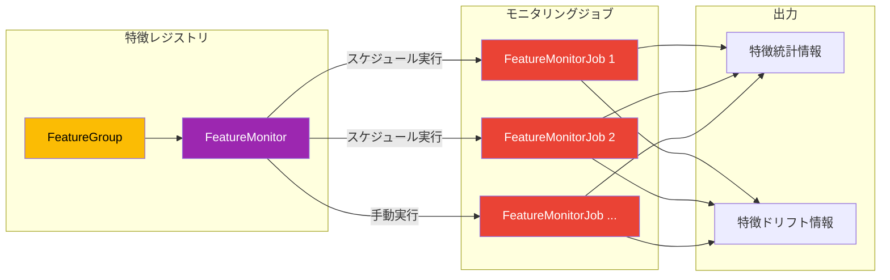

#### モニタリング方式

| モニタリング方式     | 説明                                                                                                                       |
| -------------------- | -------------------------------------------------------------------------------------------------------------------------- |
| **スケジュール実行** | FeatureMonitor リソースの作成時にモニタリング スケジュールを構成して、特徴データに対してモニタリング ジョブを定期的に実行 |
| **手動実行**         | 特徴モニタリング ジョブを手動で実行して、モニタリング スケジュール外の特徴データをモニタリング                             |

#### FeatureMonitorJob リソース

実行されるモニタリング ジョブごとに、Vertex AI Feature Store は **FeatureMonitorJob リソース**を生成します。このリソースを取得して、以下の情報を確認できます：

- 特徴の統計情報
- 特徴データで検出されたドリフトに関する情報

#### ユースケース: 特徴モニタリングを使用して特徴ドリフトを検出する

特徴モニタリングを使用すると、特徴データ内の異常（特徴ドリフト）を検出できます。

**ドリフトとは**: BigQuery の特徴データが時間の経過とともに予期せず大きく変化することです。

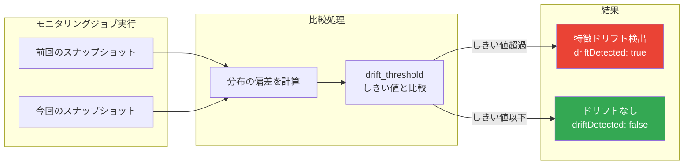

**ドリフト検出の仕組み**:

Vertex AI Feature Store では、モニタリング ジョブの実行時のスナップショットと、前回のモニタリング ジョブの実行時のデータ スナップショットを比較することで、特徴のドリフトを特定します。

**ドリフト検出時の出力**:

特徴モニターに含まれる特徴について、2 つのスナップショット間の差が `drift_threshold` パラメータで指定されたしきい値を超えると、Vertex AI Feature Store は特徴ドリフトを特定し、FeatureMonitorJob リソースで次の情報を返します：

| パラメータ         | 説明                                                                 |
| ------------------ | -------------------------------------------------------------------- |
| **driftDetected**  | `true` に設定される                                                  |
| **分布の偏差**     | 2 つのスナップショット間の分布の偏差値                               |
| **超過しきい値**   | 分布の偏差が超えたしきい値                                           |

**分布の偏差の計算方法**:

| 特徴の種類       | 計算手法                        |
| ---------------- | ------------------------------- |
| **数値特徴**     | Jensen-Shannon ダイバージェンス |
| **カテゴリ特徴** | チェビシェフ距離                |

> **補足**: Vertex AI Feature Store は、連続する特徴モニタージョブの実行からのスナップショットを比較し、BigQuery の `ML.TFDV_VALIDATE` 関数を使用してドリフトを計算します。

#### 特徴モニタリングの API 操作

##### モニタリング スケジュールを使用して特徴モニターを作成する

特徴の統計情報を取得してモニタリングするには、特徴モニタリング ジョブを定期的に実行し、特徴グループに登録されている特徴の統計情報を取得するスケジュールを指定する FeatureMonitor リソースを作成します。

> **注意**: 同じ特徴グループに複数のスケジュールを設定するには、複数の FeatureMonitor リソースを作成する必要があります。

**REST API エンドポイント**:

```
POST https://{LOCATION_ID}-aiplatform.googleapis.com/v1beta1/projects/{PROJECT_ID}/locations/{LOCATION_ID}/featureGroups/{FEATUREGROUP_NAME}/featureMonitors?feature_monitor_id={FEATURE_MONITOR_NAME}
```

**リクエストボディ**:

```json
{
  "feature_selection_config": {
    "feature_configs": [
      {"feature_id": "FEATURE_ID_1", "drift_threshold": "DRIFT_THRESHOLD_1"},
      {"feature_id": "FEATURE_ID_2", "drift_threshold": "DRIFT_THRESHOLD_2"}
    ]
  },
  "schedule_config": {
    "cron": "CRON"
  }
}
```

**パラメータ説明**:

| パラメータ           | 説明                                                                                                     |
| -------------------- | -------------------------------------------------------------------------------------------------------- |
| `LOCATION_ID`        | 特徴モニターを作成するリージョン（例: `us-central1`）                                                    |
| `PROJECT_ID`         | プロジェクト ID                                                                                          |
| `FEATUREGROUP_NAME`  | 特徴モニタリングを設定する特徴グループの名前                                                             |
| `FEATURE_MONITOR_NAME` | 作成する新しい特徴モニターの名前                                                                       |
| `FEATURE_ID_N`       | モニタリングする特徴の ID                                                                                |
| `DRIFT_THRESHOLD_N`  | 各特徴のドリフトしきい値。[0, 1) の範囲。未指定時はデフォルト `0.3`                                       |
| `CRON`               | 特徴モニタリング ジョブの実行頻度を表す cron スケジュール式                                              |

**curl コマンド例**:

```bash
curl -X POST \
     -H "Authorization: Bearer $(gcloud auth print-access-token)" \
     -H "Content-Type: application/json; charset=utf-8" \
     -d @request.json \
     "https://${LOCATION_ID}-aiplatform.googleapis.com/v1beta1/projects/${PROJECT_ID}/locations/${LOCATION_ID}/featureGroups/${FEATUREGROUP_NAME}/featureMonitors?feature_monitor_id=${FEATURE_MONITOR_NAME}"
```

##### 特徴モニタリング ジョブを手動で実行する

スケジュール設定された連続する特徴モニタリング ジョブ間の待機をスキップして、特徴モニタリング ジョブを手動で実行できます。これは、スケジュール設定された次のモニタリング ジョブの実行を待たずに、モニタリング情報を取得して特徴データ内の異常をすぐに検出する場合に便利です。

**REST API エンドポイント**:

```
POST https://{LOCATION_ID}-aiplatform.googleapis.com/v1beta1/projects/{PROJECT_ID}/locations/{LOCATION_ID}/featureGroups/{FEATUREGROUP_NAME}/featureMonitors/{FEATURE_MONITOR_ID}/featureMonitorJobs
```

**curl コマンド例**:

```bash
curl -X POST \
     -H "Authorization: Bearer $(gcloud auth print-access-token)" \
     -H "Content-Type: application/json; charset=utf-8" \
     -d "" \
     "https://${LOCATION_ID}-aiplatform.googleapis.com/v1beta1/projects/${PROJECT_ID}/locations/${LOCATION_ID}/featureGroups/${FEATUREGROUP_NAME}/featureMonitors/${FEATURE_MONITOR_ID}/featureMonitorJobs"
```

##### 特徴モニタージョブを一覧表示する

指定された FeatureMonitor リソースの FeatureMonitorJob リソースのリストを取得できます。

**REST API エンドポイント**:

```
GET https://{LOCATION_ID}-aiplatform.googleapis.com/v1beta1/projects/{PROJECT_ID}/locations/{LOCATION_ID}/featureGroups/{FEATUREGROUP_NAME}/featureMonitors/{FEATURE_MONITOR_NAME}/featureMonitorJobs
```

**curl コマンド例**:

```bash
curl -X GET \
     -H "Authorization: Bearer $(gcloud auth print-access-token)" \
     "https://${LOCATION_ID}-aiplatform.googleapis.com/v1beta1/projects/${PROJECT_ID}/locations/${LOCATION_ID}/featureGroups/${FEATUREGROUP_NAME}/featureMonitors/${FEATURE_MONITOR_NAME}/featureMonitorJobs"
```

**レスポンス例**:

```json
{
  "featureMonitorJobs": [
    {
      "name": "projects/PROJECT_NUMBER/locations/LOCATION_ID/featureGroups/FEATUREGROUP_NAME/featureMonitors/FEATURE_MONITOR_NAME/featureMonitorJobs/FEATURE_MONITOR_JOB_ID_1",
      "createTime": "2024-12-18T19:18:18.077161Z",
      "finalStatus": {},
      "featureSelectionConfig": {
        "featureConfigs": [
          {"featureId": "feature_name_1", "driftThreshold": 0.2},
          {"featureId": "feature_name_2", "driftThreshold": 0.2}
        ]
      }
    }
  ]
}
```

##### モニタリング ジョブから特徴の統計情報を表示する

FeatureMonitorJob リソースを取得して、特徴モニタリング ジョブのすべての特徴の統計情報を表示できます。特徴ごとに、統計情報と異常値が `FeatureNameStatistics` 形式で表示されます。

**REST API エンドポイント**:

```
GET https://{LOCATION_ID}-aiplatform.googleapis.com/v1beta1/projects/{PROJECT_ID}/locations/{LOCATION_ID}/featureGroups/{FEATUREGROUP_NAME}/featureMonitors/{FEATURE_MONITOR_NAME}/featureMonitorJobs/{FEATURE_MONITOR_JOB_ID}
```

**curl コマンド例**:

```bash
curl -X GET \
     -H "Authorization: Bearer $(gcloud auth print-access-token)" \
     "https://${LOCATION_ID}-aiplatform.googleapis.com/v1beta1/projects/${PROJECT_ID}/locations/${LOCATION_ID}/featureGroups/${FEATUREGROUP_NAME}/featureMonitors/${FEATURE_MONITOR_NAME}/featureMonitorJobs/${FEATURE_MONITOR_JOB_ID}"
```

**レスポンスに含まれる主要フィールド**:

| フィールド                      | 説明                                           |
| ------------------------------- | ---------------------------------------------- |
| `jobSummary.featureStatsAndAnomalies` | 各特徴の統計情報と異常値                 |
| `driftBaseFeatureMonitorJobId`  | 比較対象となった前回のモニタリングジョブ ID    |
| `driftBaseSnapshotTime`         | 比較対象となった前回のスナップショット時刻     |
| `triggerType`                   | ジョブのトリガータイプ（スケジュール/オンデマンド） |

##### 特定の特徴の統計情報を表示する

実行された最新の特徴モニタリング ジョブから特定の特徴の統計情報を取得できます。統計情報を取得するモニタリング ジョブの数を指定することで、複数のジョブからの統計情報を取得可能です。

**REST API エンドポイント**:

```
GET https://{LOCATION_ID}-aiplatform.googleapis.com/v1beta1/projects/{PROJECT_ID}/locations/{LOCATION_ID}/featureGroups/{FEATUREGROUP_NAME}/features/{FEATURE_NAME}?feature_stats_and_anomaly_spec.latest_stats_count={LATEST_STATS_COUNT}
```

**パラメータ説明**:

| パラメータ           | 説明                                                     |
| -------------------- | -------------------------------------------------------- |
| `FEATURE_NAME`       | 特徴の統計情報を取得する Feature リソースの名前          |
| `LATEST_STATS_COUNT` | 特徴の統計情報を取得する最新のモニタリング ジョブの数    |

**curl コマンド例**:

```bash
curl -X GET \
     -H "Authorization: Bearer $(gcloud auth print-access-token)" \
     "https://${LOCATION_ID}-aiplatform.googleapis.com/v1beta1/projects/${PROJECT_ID}/locations/${LOCATION_ID}/featureGroups/${FEATUREGROUP_NAME}/features/${FEATURE_NAME}?feature_stats_and_anomaly_spec.latest_stats_count=${LATEST_STATS_COUNT}"
```

### 5. エンベディングの管理とベクトル検索

Vertex AI Feature Store の**最適化されたオンライン サービング**では、エンベディング管理がサポートされています。

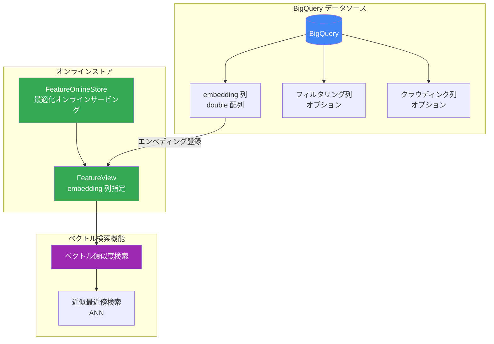

#### エンベディング管理の設定手順

| ステップ                    | 説明                                                                                                |
| --------------------------- | --------------------------------------------------------------------------------------------------- |
| **1. データソース準備**     | BigQuery に embedding 列（double 配列）を追加。必要に応じてフィルタリング列とクラウディング列も追加 |
| **2. オンラインストア作成** | 最適化されたオンライン サービング用のオンライン ストア インスタンスを作成                           |
| **3. 特徴ビュー作成**       | 特徴ビューの作成時に embedding 列を指定                                                             |

#### ベクトル検索機能

エンベディング管理機能を使用して、以下のベクトル類似度検索が可能です：

- 指定したエンティティに対する近似最近傍のエンティティを取得
- 指定したエンベディング値に対する近似最近傍のエンティティを取得

---

## Vertex AI Feature Store（従来版）

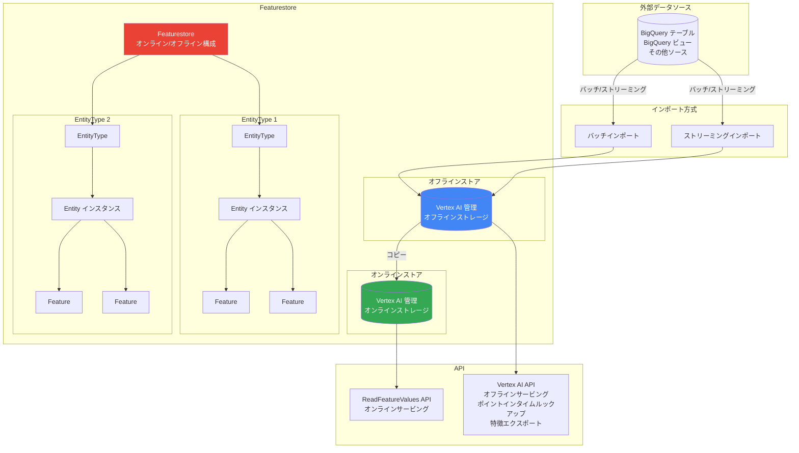

### 特徴

- **オンライン/オフラインストア分離**: Featurestore プロビジョニング時に両方作成
- **データインポート必須**: 外部ソースからバッチまたはストリーミングでインポート
- **階層構造**: Featurestore → EntityType → Entity → Feature
- **1 種類のオンラインサービング**: エンティティと特徴を指定して取得

---

## アーキテクチャ比較サマリー

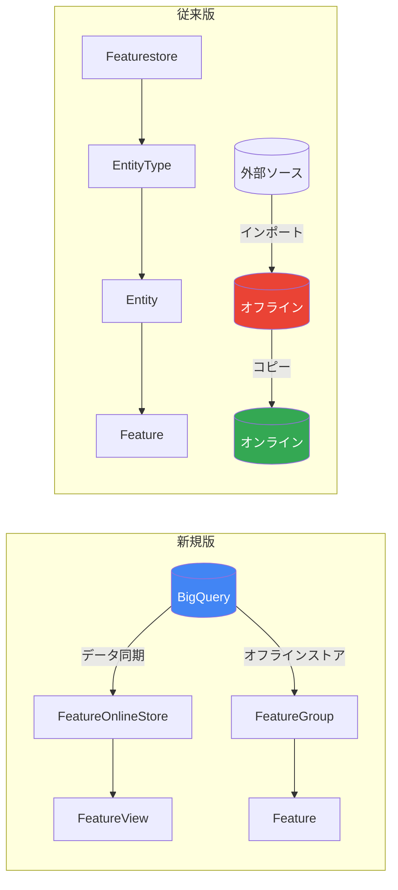

| 観点                 | 新規版                           | 従来版                              |
| -------------------- | -------------------------------- | ----------------------------------- |
| オフラインストア     | BigQuery（既存利用）             | Vertex AI 管理                      |
| データインポート     | 不要（BigQuery 直接参照）        | バッチ/ストリーミング必須           |
| オンラインサービング | 2 種類（Bigtable/最適化）        | 1 種類                              |
| リソース階層         | FeatureOnlineStore → FeatureView | Featurestore → EntityType → Feature |
| 特徴レジストリ       | あり（FeatureGroup）             | なし                                |
| ベクトル検索         | あり（最適化サービングで対応）   | なし                                |
| メタデータ管理       | Dataplex Universal Catalog 統合  | 限定的                              |
| API                  | FetchFeatureValues               | ReadFeatureValues                   |
