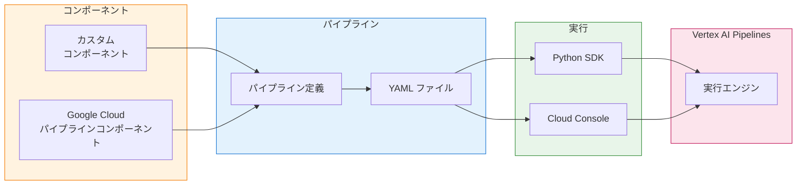
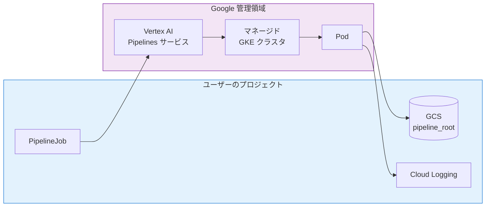
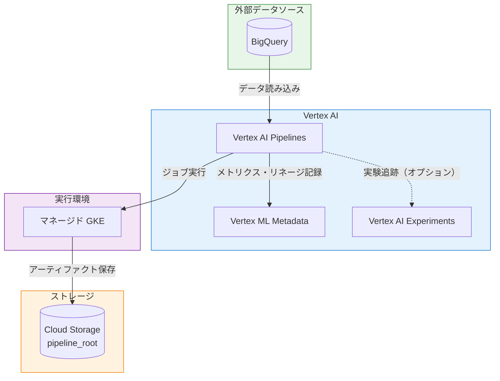
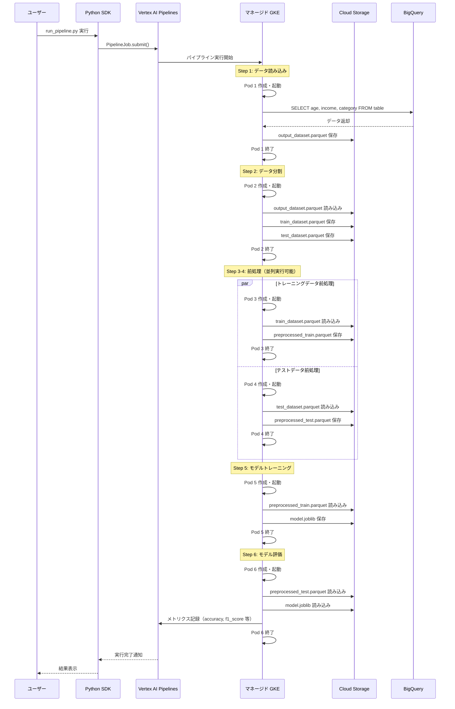
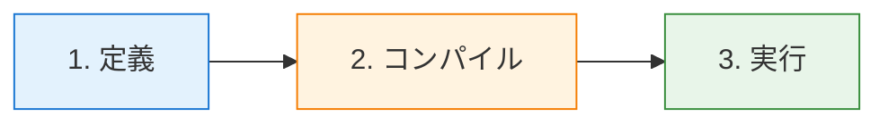

# Vertex AI Pipelines アーキテクチャ

## 概要

Vertex AI Pipelines は、ML ワークフローの自動化、モニタリング、管理を行うためのサービスです。本ドキュメントでは Kubeflow Pipelines (KFP) SDK を使用したパイプライン構築について説明します。

> **注意**: TFX SDK はテラバイト規模の構造化データ/テキストデータ処理向けです。それ以外のユースケースには KFP を使用してください。

---

## アーキテクチャ



### 実行環境

Vertex AI Pipelines の各コンポーネントは **Google が管理するマネージド GKE クラスタ** 上で実行されます。



| 項目 | 説明 |
|-----|------|
| GKE クラスタ | Google 管理、ユーザーからは不可視・管理不要 |
| アーティファクト | `pipeline_root` の GCS バケットに保存 |
| ログ | Cloud Logging に出力 |
| メタデータ | Vertex ML Metadata に記録 |
| 課金 | コンピュート時間に基づく |

> **注意**: 初回実行時はコンテナイメージのプルと Pod スケジューリングに数分かかる場合があります。`gcr.io/deeplearning-platform-release/base-cpu:latest` などの Google 提供イメージを使用すると高速化できます。

### Vertex AI サービス連携

本サンプルパイプラインでは、以下の Vertex AI サービスと連携しています。



#### 連携サービス一覧

| サービス | 役割 | 本サンプルでの使用 |
|---------|------|-------------------|
| **Vertex AI Pipelines** | パイプラインオーケストレーション | ✅ 使用 |
| **Vertex ML Metadata** | メトリクス・リネージ記録 | ✅ 自動連携 |
| **Vertex AI Experiments** | 実験追跡・比較 | ⚙️ オプション |
| **Model Registry** | モデルバージョン管理 | ❌ 未使用（拡張可能） |
| **Endpoints** | モデルデプロイ・推論 | ❌ 未使用（拡張可能） |

#### Vertex AI Experiments との連携

パイプライン実行を Experiment に関連付けることで、複数実行のパラメータと指標を体系的に追跡・比較できます。

**設定方法（config.yaml）**:

```yaml
experiments:
  enabled: true
  experiment_name: "ml-training-experiment"
  description: "ML Training Pipeline の実験追跡"
```

**コマンドラインでの切り替え**:

```bash
# Experiments 連携を有効にして実行
python run_pipeline.py --pipeline ml_training --experiment

# Experiments 連携を無効にして実行（config.yaml の設定を上書き）
python run_pipeline.py --pipeline ml_training --no-experiment
```

**Experiments で確認できる情報**:

- パイプライン実行ごとのハイパーパラメータ（n_estimators, max_depth 等）
- 評価指標（accuracy, f1_score, precision, recall）
- 複数実行の比較・可視化
- 最適なハイパーパラメータの特定

### パイプライン実行フロー（ML Training Pipeline の例）

以下は、BigQuery からデータを読み込み、分類モデルをトレーニング・評価する ML パイプラインの実行フローです。



#### GCS に保存されるアーティファクト構造

```
gs://bucket/pipeline-root/{run_id}/
├── load_data_from_bigquery/
│   └── output_dataset/
│       └── data.parquet          # BigQuery から取得した生データ
├── split_data/
│   ├── train_dataset/
│   │   └── data.parquet          # トレーニングデータ（80%）
│   └── test_dataset/
│       └── data.parquet          # テストデータ（20%）
├── preprocess_data-1/            # トレーニングデータ前処理
│   └── output_dataset/
│       └── data.parquet          # 標準化済みトレーニングデータ
├── preprocess_data-2/            # テストデータ前処理
│   └── output_dataset/
│       └── data.parquet          # 標準化済みテストデータ
├── train_model/
│   └── output_model/
│       └── model.joblib          # トレーニング済みモデル
└── evaluate_model/
    └── evaluation_metrics/       # 評価メトリクス（ML Metadata にも記録）
```

#### アーティファクトの種類と形式

Vertex AI Pipelines では、KFP SDK が提供するアーティファクト型を使用してコンポーネント間でデータを受け渡します。各アーティファクト型には推奨されるファイル形式があります。

| アーティファクト型 | 用途 | 推奨形式 | 説明 |
|------------------|------|----------|------|
| `Dataset` | データセット | Parquet, CSV, JSON | 構造化データの保存に使用。Parquet 推奨（型情報保持・圧縮効率） |
| `Model` | 学習済みモデル | joblib, pickle, SavedModel | sklearn は joblib、TensorFlow は SavedModel 形式 |
| `Metrics` | 評価指標 | JSON（自動生成） | `log_metric()` で記録、ML Metadata にも自動登録 |
| `Artifact` | 汎用 | 任意 | 上記に該当しない任意のファイル |
| `HTML` | レポート | HTML | 可視化レポートなど |
| `Markdown` | ドキュメント | Markdown | テキストベースのドキュメント |
| `ClassificationMetrics` | 分類指標 | JSON（自動生成） | 混同行列、ROC 曲線などの分類タスク専用指標 |

##### 本サンプルで使用しているアーティファクト形式

```python
# Dataset: Parquet 形式で保存
df.to_parquet(output_dataset.path, index=False)

# Model: joblib 形式で保存
import joblib
joblib.dump(model, output_model.path + ".joblib")

# Metrics: log_metric() で JSON として自動保存
training_metrics.log_metric("accuracy", 0.95)
training_metrics.log_metric("f1_score", 0.92)
```

##### Metrics アーティファクトの仕組み

`Metrics` アーティファクトは特殊で、`log_metric()` メソッドを使用すると自動的に JSON 形式でメタデータが記録されます。

```json
{
  "accuracy": 0.95,
  "f1_score": 0.92,
  "precision": 0.94,
  "recall": 0.93
}
```

これらの指標は以下の場所で確認できます：
- **Cloud Console**: パイプライン実行 → ステップ詳細 → 出力パラメータ
- **Vertex ML Metadata**: アーティファクトのメタデータとして永続化
- **パイプライン比較**: 複数実行の指標を並べて比較可能

#### 実行時の特徴

| 項目 | 説明 |
|-----|------|
| Pod ライフサイクル | 各ステップごとに Pod が作成 → 実行 → 終了（都度デプロイ） |
| 依存関係の解決 | DAG（有向非巡回グラフ）に従って順序制御 |
| 並列実行 | 依存関係がないステップ（前処理 2 つ）は同時実行可能 |
| データ受け渡し | GCS 経由で Parquet 形式のファイルを共有 |
| モデル保存 | joblib 形式で GCS に永続化 |

---

## 環境セットアップ

```bash
# 必要なパッケージ
pip install "kfp>=2,<3"                      # KFP SDK v2
pip install google-cloud-aiplatform          # Vertex AI SDK
pip install google-cloud-pipeline-components # Google Cloud コンポーネント
```

```bash
# 認証設定
export GOOGLE_APPLICATION_CREDENTIALS="/path/to/service-account-key.json"
```

| 必要なロール | 説明 |
|------------|------|
| Vertex AI ユーザー | パイプライン実行に必要 |
| サービスアカウントユーザー | 他サービスアカウントへのアクセス |

---

## パイプライン構築フロー



### 1. パイプライン定義

```python
import kfp
from google_cloud_pipeline_components.v1.dataset import ImageDatasetCreateOp
from google_cloud_pipeline_components.v1.automl.training_job import AutoMLImageTrainingJobRunOp
from google_cloud_pipeline_components.v1.endpoint import EndpointCreateOp, ModelDeployOp

@kfp.dsl.pipeline(name="ml-pipeline", pipeline_root="gs://bucket/root")
def pipeline(project_id: str):
    # データセット作成
    ds_op = ImageDatasetCreateOp(project=project_id, display_name="dataset")

    # モデルトレーニング（前ステップの出力を入力に）
    train_op = AutoMLImageTrainingJobRunOp(
        project=project_id,
        dataset=ds_op.outputs["dataset"],
    )

    # デプロイ
    endpoint_op = EndpointCreateOp(project=project_id)
    ModelDeployOp(
        model=train_op.outputs["model"],
        endpoint=endpoint_op.outputs["endpoint"],
    )
```

### 2. コンパイル

```python
from kfp import compiler

compiler.Compiler().compile(
    pipeline_func=pipeline,
    package_path="pipeline.yaml"
)
```

### 3. 実行

```python
from google.cloud import aiplatform

aiplatform.init(project="your-project", location="asia-northeast1")

job = aiplatform.PipelineJob(
    display_name="ml-pipeline",
    template_path="pipeline.yaml",
    pipeline_root="gs://bucket/root",
    parameter_values={"project_id": "your-project"}
)
job.submit()
```

#### PipelineJob パラメータ

| パラメータ | 型 | 説明 |
|-----------|-----|------|
| `display_name` | str | パイプラインジョブの表示名 |
| `template_path` | str | コンパイル済み YAML ファイルのパス（ローカルまたは GCS） |
| `job_id` | str | ジョブ ID（省略時は自動生成） |
| `pipeline_root` | str | パイプラインのルート GCS パス |
| `parameter_values` | dict | パイプラインパラメータの値 |
| `enable_caching` | bool | キャッシュ有効化（デフォルト: True） |
| `labels` | dict | ジョブに付与するラベル |
| `project` | str | GCP プロジェクト ID |
| `location` | str | リージョン |
| `failure_policy` | str | 失敗ポリシー（`slow` または `fast`） |

#### submit() メソッドのオプション

| パラメータ | 型 | 説明 |
|-----------|-----|------|
| `service_account` | str | 実行に使用するサービスアカウント |
| `network` | str | VPC ネットワーク名 |

#### KFP 特殊入力プレースホルダー

パイプライン内で実行時の情報を参照するためのプレースホルダーです。

| プレースホルダー | 説明 |
|-----------------|------|
| `{{$.pipeline_job_name_placeholder}}` | パイプラインジョブのリソース名 |
| `{{$.pipeline_job_id_placeholder}}` | パイプラインジョブ ID |
| `{{$.pipeline_task_name_placeholder}}` | タスク名 |
| `{{$.pipeline_task_id_placeholder}}` | タスク ID |
| `{{$.pipeline_job_resource_name_placeholder}}` | 完全なリソース名 |
| `{{$.pipeline_job_create_time_utc_placeholder}}` | ジョブ作成時刻（UTC） |
| `{{$.pipeline_job_schedule_time_utc_placeholder}}` | スケジュール実行時刻（UTC） |
| `{{$.pipeline_root_placeholder}}` | パイプラインルート GCS パス |

---

## テンプレート管理（Artifact Registry）

パイプラインテンプレートを Artifact Registry で管理することで、バージョン管理と再利用が可能になります。

### テンプレートのアップロード

1. Cloud Console で Vertex AI Pipelines を開く
2. **[アップロード]** → リポジトリを選択
3. コンパイル済み YAML ファイルをアップロード

### Artifact Registry からの実行

```python
from google.cloud import aiplatform

aiplatform.init(
    project="PROJECT_ID",
    location="us-central1",
    staging_bucket="gs://STAGING_BUCKET"
)

# バージョン SHA256 で指定
job = aiplatform.PipelineJob(
    display_name="hello-world",
    template_path="https://us-central1-kfp.pkg.dev/PROJECT_ID/REPO/hello-world@SHA256_TAG"
)

# タグで指定
job = aiplatform.PipelineJob(
    display_name="hello-world",
    template_path="https://us-central1-kfp.pkg.dev/PROJECT_ID/REPO/hello-world/latest"
)

job.submit()
```

### パイプライン実行の検索

```python
# 特定バージョンの実行を検索
filter = 'template_uri:"https://REGION-kfp.pkg.dev/PROJECT/REPO/PIPELINE/*" AND template_metadata.version="VERSION"'
aiplatform.PipelineJob.list(filter=filter)

# 特定タグの実行を検索
filter = 'template_uri="https://REGION-kfp.pkg.dev/PROJECT/REPO/PIPELINE/TAG"'
aiplatform.PipelineJob.list(filter=filter)

# リポジトリ内の全実行を検索
filter = 'template_uri:"https://REGION-kfp.pkg.dev/PROJECT/REPO/*"'
aiplatform.PipelineJob.list(filter=filter)
```

---

## 実行キャッシュ

Vertex AI Pipelines は、パイプライン実行時に各ステップのキャッシュキーを Vertex ML Metadata で確認し、一致する実行があればその出力を再利用します。

### キャッシュキーの構成要素

| 要素 | 内容 |
|-----|------|
| 入力 | パラメータ値、入力アーティファクト ID |
| 出力定義 | パラメータ名、アーティファクト定義 |
| コンポーネント仕様 | イメージ、コマンド、引数、環境変数 |

> **注意**: 同じパイプライン名を持つパイプラインのみがキャッシュを共有します。

### キャッシュの制御

```python
# タスクレベルで無効化
eval_task.set_caching_options(False)

# パイプライン全体で無効化
job = aiplatform.PipelineJob(
    display_name="My pipeline",
    template_path="pipeline.yaml",
    enable_caching=False,  # True: 有効, False: 無効, None: 各コンポーネントに委任
    parameter_values=parameter_values,
    pipeline_root=pipeline_root,
)
```

### 制限事項

- キャッシュ結果に TTL はなく、ML Metadata から削除されるまで再利用可能
- コンポーネントは**決定論的**に構築する必要あり（同じ入力 → 同じ出力）
- 非決定論的コンポーネントは予期せずスキップされる可能性あり

---

## コンポーネント

| 種別 | 説明 |
|-----|------|
| **カスタム** | `@kfp.dsl.component` で独自に構築 |
| **Google Cloud** | AutoML、BigQuery 等の構築済みコンポーネント |

### カスタムトレーニングジョブへの変換

Python コンポーネントを Vertex AI カスタムトレーニングジョブに変換し、GPU/TPU などのマシンリソースを指定して実行できます。

```python
from kfp import dsl
from google_cloud_pipeline_components.v1.custom_job import create_custom_training_job_from_component

@dsl.component
def my_training_component():
    # トレーニング処理
    pass

# カスタムトレーニングジョブに変換
custom_training_job = create_custom_training_job_from_component(
    my_training_component,
    display_name="training-job",
    machine_type="n1-standard-4",
    accelerator_type="NVIDIA_TESLA_T4",
    accelerator_count=1,
)

@dsl.pipeline(name="training-pipeline", pipeline_root="gs://bucket/root")
def pipeline():
    training_job_task = custom_training_job(
        project="PROJECT_ID",
        location="asia-northeast1",
    )
```

#### マシンリソースパラメータ

| パラメータ | 説明 |
|-----------|------|
| `machine_type` | マシンタイプ（例: `n1-standard-4`, `e2-standard-4`） |
| `accelerator_type` | GPU/TPU タイプ（例: `NVIDIA_TESLA_T4`, `NVIDIA_A100_80GB`） |
| `accelerator_count` | アクセラレータ数（デフォルト: 1） |
| `boot_disk_type` | ブートディスクタイプ |
| `boot_disk_size_gb` | ブートディスクサイズ（GB） |
| `network` | VPC ネットワーク名 |
| `persistent_resource_id` | 永続リソース ID（プレビュー） |

---

## モニタリングと分析

Metrics Explorer、Cloud Logging、Cloud Console を使用してパイプラインのパフォーマンス分析と障害モニタリングができます。

### 実行の可視化（Cloud Console）

1. Vertex AI Pipelines を開く
2. パイプライン実行の実行名をクリック
3. ランタイムグラフでワークフローステップを確認

#### 確認できる情報

| 対象 | 内容 |
|-----|------|
| パイプラインサマリー | 基本情報、使用パラメータ |
| ステップ詳細 | 実行詳細、入出力パラメータ、ログ |
| アーティファクト | データ型、GCS 保存場所、指標、ML Metadata リネージ |

### 実行の比較

複数のパイプライン実行を選択し、**[比較]** をクリックすることで、パラメータと指標を並べて比較できます。ハイパーパラメータがモデル指標に与える影響を分析するのに有用です。

### 標準指標（Metrics Explorer）

| レベル | 指標 | 説明 |
|-------|------|------|
| ジョブ | PipelineJob duration | パイプライン実行のランタイム所要時間 |
| ジョブ | Executing PipelineJobs | 実行中のパイプライン数 |
| タスク | Completed PipelineTasks | 完了したタスク数 |
| タスク | Executing PipelineTasks | 実行中のタスク数 |

#### フィルタオプション

- `pipeline_job_id`: 特定のパイプラインジョブ
- `location`: 特定のリージョン
- `run_state`: 状態別（SUCCEEDED, FAILED, CANCELLED, RUNNING, PENDING）

### カスタム指標（Cloud Logging）

ログベースの指標を作成してパイプラインログのパターンを追跡できます。

#### 失敗したジョブの指標

```
resource.type="aiplatform.googleapis.com/PipelineJob"
jsonPayload.state="PIPELINE_STATE_FAILED"
```

#### 最終状態の指標

```
resource.type="aiplatform.googleapis.com/PipelineJob"
jsonPayload.state="PIPELINE_STATE_SUCCEEDED" OR
"PIPELINE_STATE_FAILED" OR "PIPELINE_STATE_CANCELLED"
```

> **注意**: カスタム指標の作成には Cloud Logging の料金が発生します。

### リネージ追跡

パイプラインアーティファクト（モデル、データセット、パラメータ）の来歴と派生関係を追跡できます。

#### Vertex ML Metadata vs Dataplex Universal Catalog

| 機能 | Vertex ML Metadata | Dataplex Universal Catalog |
|-----|-------------------|---------------------------|
| スコープ | 単一リージョン・単一プロジェクト | グローバル・組織全体 |
| オプトイン | 不要（常時オン） | Data Lineage API の有効化が必要 |
| 統合 | Pipelines, Experiments, Model Registry | BigQuery, Cloud Composer, Dataproc 等 |

#### リネージで分析できる内容

- 特定のパイプライン実行が高精度モデルを生成した理由
- 最も正確なモデルとそのハイパーパラメータ
- 特定時点で本番環境にあったモデルバージョン

#### リネージグラフの表示

**Vertex ML Metadata**:
1. Cloud Console → Vertex AI → メタデータ
2. リージョンを選択
3. アーティファクトをクリック → リネージグラフを表示

**Dataplex Universal Catalog**:
1. Dataplex Universal Catalog → 検索
2. フィルタでアーティファクトを検索
3. アーティファクト名をクリック → リネージタブ

---

## ベストプラクティス

| 項目 | 推奨事項 |
|-----|---------|
| コンポーネント設計 | 単一責任、再利用性、疎結合 |
| セキュリティ | 専用サービスアカウントを使用（デフォルトは過剰権限） |
| メンテナンス | SDK を定期更新、脆弱性パッチ時は再コンパイル |

---

## 参考リンク

- [Kubeflow Pipelines ドキュメント](https://www.kubeflow.org/docs/components/pipelines/)
- [Google Cloud パイプラインコンポーネント](https://cloud.google.com/vertex-ai/docs/pipelines/gcpc-list)
- [パイプラインの構築](https://cloud.google.com/vertex-ai/docs/pipelines/build-pipeline)
