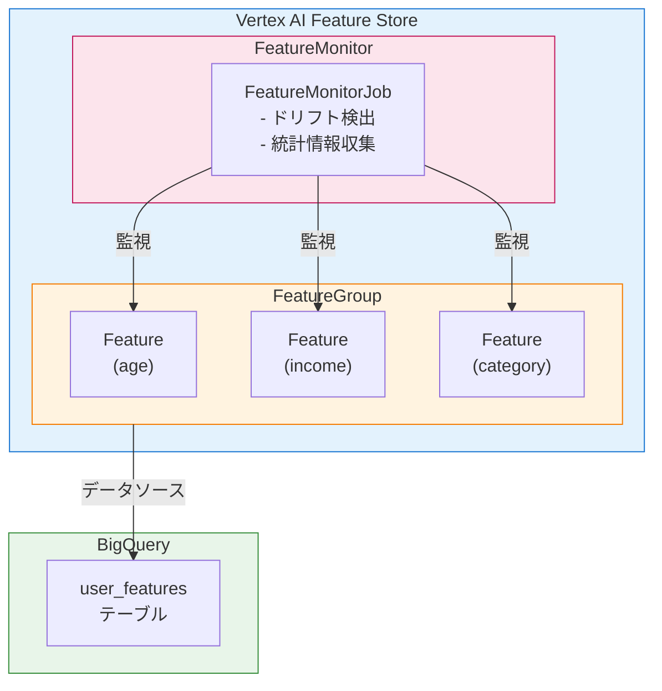
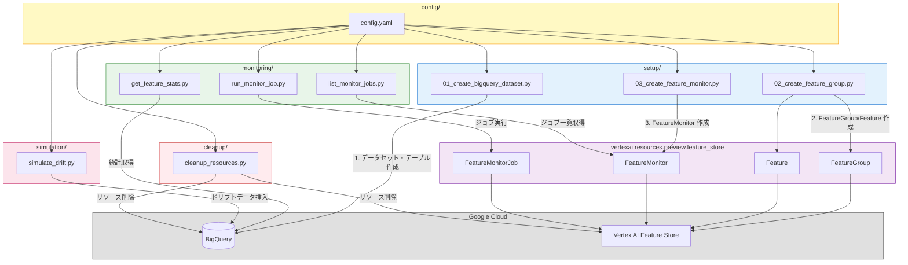
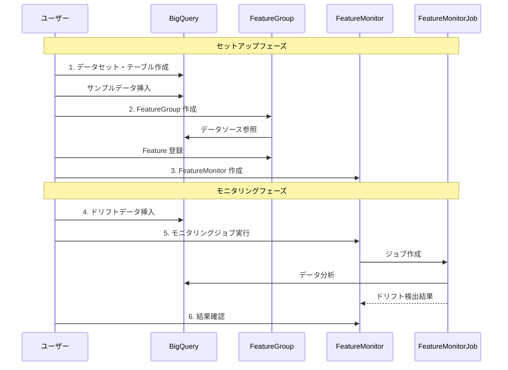

# Vertex AI Feature Store - Feature Monitoring サンプル

このサンプルアプリケーションは、Vertex AI Feature Store の特徴量モニタリング機能を体験するためのものです。

## 概要

このサンプルでは以下を実行できます：

1. **BigQuery にサンプル特徴データを作成**
2. **FeatureGroup と Feature を登録**
3. **FeatureMonitor を設定してドリフト検出を有効化**
4. **特徴量ドリフトをシミュレート**
5. **モニタリングジョブを実行してドリフトを検出**

## アーキテクチャ



## コードアーキテクチャ



### 実行フロー



## 前提条件

- Google Cloud プロジェクト
- 以下の API が有効化されていること：
  - Vertex AI API
  - BigQuery API
- Python 3.11 以上
- Google Cloud SDK（gcloud）がインストール・認証済み

## セットアップ

### 1. 依存関係のインストール

```bash
cd vertexai-mlops/featurestore-sample
pip install -r requirements.txt
```

### 2. 設定ファイルの編集

`config/config.yaml` を編集して、プロジェクト ID を設定します：

```yaml
project_id: "your-actual-project-id"  # 実際のプロジェクト ID に置き換え
```

### 3. 認証

```bash
gcloud auth application-default login
```

## 使用方法

### Step 1: BigQuery データセット・テーブルの作成

```bash
python setup/01_create_bigquery_dataset.py
```

このスクリプトは：
- BigQuery データセット `feature_store_sample` を作成
- テーブル `user_features` を作成
- 100 件のサンプルデータを挿入

### Step 2: FeatureGroup と Feature の作成

```bash
python setup/02_create_feature_group.py
```

このスクリプトは：
- BigQuery テーブルをソースとする FeatureGroup を作成
- `age`, `income`, `category` の 3 つの Feature を登録

### Step 3: FeatureMonitor の作成

```bash
python setup/03_create_feature_monitor.py
```

このスクリプトは：
- FeatureGroup に対する FeatureMonitor を作成
- 各特徴量のドリフト閾値を設定（デフォルト: 0.3）
- スケジュール実行を設定（毎日午前 9 時）

### Step 4: 特徴量統計の確認

```bash
python monitoring/get_feature_stats.py

# 詳細情報を表示
python monitoring/get_feature_stats.py --detailed
```

### Step 5: ドリフトのシミュレーション

```bash
# ドライラン（データを挿入せずに確認）
python simulation/simulate_drift.py --dry-run

# 実際にドリフトデータを挿入
python simulation/simulate_drift.py
```

このスクリプトは：
- 分布が変化したデータ（ドリフトデータ）を生成
- BigQuery テーブルに追加
- ドリフト前後の統計を比較

### Step 6: モニタリングジョブの実行

```bash
# ジョブを実行（完了を待機）
python monitoring/run_monitor_job.py --wait

# ジョブを実行（バックグラウンド）
python monitoring/run_monitor_job.py
```

### Step 7: ジョブ結果の確認

```bash
# ジョブ一覧を表示
python monitoring/list_monitor_jobs.py

# 特定のジョブの詳細を表示
python monitoring/list_monitor_jobs.py --job-id <JOB_ID>
```

## クリーンアップ

作成したリソースを削除するには：

```bash
# Feature Store リソースのみ削除
python cleanup/cleanup_resources.py

# BigQuery リソースも含めて削除
python cleanup/cleanup_resources.py --include-bigquery

# 確認なしで削除
python cleanup/cleanup_resources.py --include-bigquery --force
```

## ドリフト検出について

### 検出アルゴリズム

| 特徴量タイプ | アルゴリズム | 説明 |
|-------------|-------------|------|
| 数値型 | Jensen-Shannon Divergence | 2 つの確率分布間の類似度を測定 |
| カテゴリ型 | Chebyshev Distance | カテゴリ分布の最大差分を測定 |

### 閾値の設定

`config/config.yaml` で各特徴量のドリフト閾値を設定できます：

```yaml
feature_store:
  features:
    - name: "age"
      type: "INT64"
      drift_threshold: 0.3  # 0.0 〜 1.0
```

- `0.0`: 最も厳密（わずかな変化も検出）
- `1.0`: 最も緩い（大きな変化のみ検出）
- 推奨値: `0.2` 〜 `0.4`

## サンプルデータの分布

### 初期データ

| 特徴量 | 分布 |
|--------|------|
| age | 平均 35, 標準偏差 10 |
| income | 平均 60,000, 標準偏差 20,000 |
| category | A: 50%, B: 30%, C: 20% |

### ドリフト後データ

| 特徴量 | 分布 |
|--------|------|
| age | 平均 45, 標準偏差 15 |
| income | 平均 80,000, 標準偏差 30,000 |
| category | A: 20%, B: 20%, C: 30%, D: 30% |

## ディレクトリ構成

```
featurestore-sample/
├── README.md                 # このファイル
├── requirements.txt          # Python 依存関係
├── config/
│   └── config.yaml          # 設定ファイル
├── setup/
│   ├── 01_create_bigquery_dataset.py  # BigQuery セットアップ
│   ├── 02_create_feature_group.py     # FeatureGroup 作成
│   └── 03_create_feature_monitor.py   # FeatureMonitor 作成
├── monitoring/
│   ├── run_monitor_job.py    # モニタリングジョブ実行
│   ├── list_monitor_jobs.py  # ジョブ一覧取得
│   └── get_feature_stats.py  # 統計情報取得
├── simulation/
│   └── simulate_drift.py     # ドリフトシミュレーション
└── cleanup/
    └── cleanup_resources.py  # リソースクリーンアップ
```

## トラブルシューティング

### API が有効化されていない

```
google.api_core.exceptions.PermissionDenied: 403 Vertex AI API has not been enabled
```

解決策：
```bash
gcloud services enable aiplatform.googleapis.com
gcloud services enable bigquery.googleapis.com
```

### 認証エラー

```
google.auth.exceptions.DefaultCredentialsError
```

解決策：
```bash
gcloud auth application-default login
```

### FeatureGroup が見つからない

FeatureGroup の作成には数分かかることがあります。しばらく待ってから再試行してください。

## 参考資料

- [Vertex AI Feature Store ドキュメント](https://cloud.google.com/vertex-ai/docs/featurestore)
- [Feature Monitoring ガイド](https://cloud.google.com/vertex-ai/docs/featurestore/latest/monitor-features)
- [REST API リファレンス](https://cloud.google.com/vertex-ai/docs/reference/rest/v1beta1/projects.locations.featureGroups.featureMonitors)
