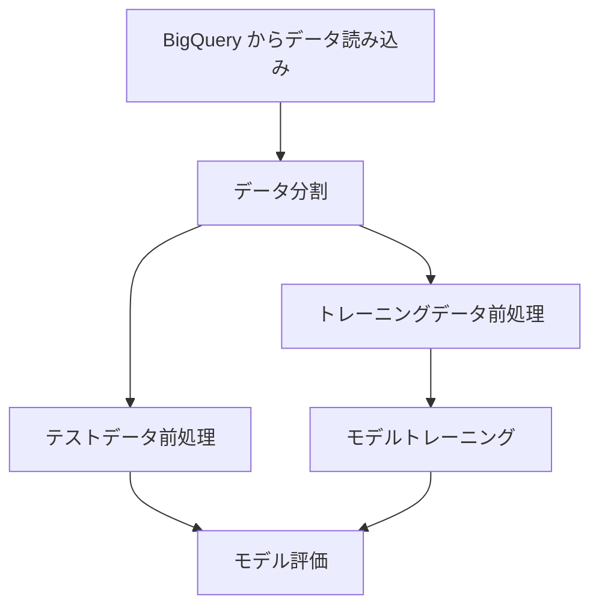

# Vertex AI Pipelines サンプル

Kubeflow Pipelines SDK (KFP) を使用した Vertex AI Pipelines のサンプルコードです。

## 概要

このサンプルでは、以下の 2 つのパイプラインを提供しています：

1. **Simple Pipeline**: Hello World パイプライン（動作確認用）
2. **ML Training Pipeline**: BigQuery からデータを読み込み、モデルをトレーニング・評価する ML パイプライン

## ディレクトリ構成

```
vertexai-mlops/
├── config.yaml               # 共通設定ファイル
└── pipelines-sample/
    ├── README.md
    ├── requirements.txt
    ├── components/
    │   ├── __init__.py
    │   ├── data_components.py   # データ処理コンポーネント
    │   └── training_components.py # トレーニングコンポーネント
    ├── pipelines/
    │   ├── __init__.py
    │   └── training_pipeline.py # パイプライン定義
    ├── compiled/                 # コンパイル済み YAML（自動生成）
    ├── compile_pipeline.py       # コンパイルスクリプト
    └── run_pipeline.py           # 実行スクリプト
```

## セットアップ

### 1. 依存関係のインストール

```bash
cd pipeline-sample
pip install -r requirements.txt
```

### 2. 設定ファイルの編集

親ディレクトリの `vertexai-mlops/config.yaml` を編集して、プロジェクト ID やバケット名を設定します：

```yaml
project_id: "your-project-id"
location: "asia-northeast1"

gcs:
  bucket: "your-bucket-name"
  pipeline_root: "gs://your-bucket-name/pipeline-root"
  staging_bucket: "gs://your-bucket-name/staging"

pipelines:
  name: "ml-training-pipeline"
  data:
    source_table: "your-project-id.feature_store_sample.user_features"
    # ...
```

### 3. 認証

```bash
gcloud auth application-default login
```

## 使い方

### パイプラインのコンパイル

```bash
# Simple パイプラインをコンパイル
python compile_pipeline.py --pipeline simple

# ML Training パイプラインをコンパイル
cpython compile_pipeline.py --pipeline ml_training

# すべてのパイプラインをコンパイル
python compile_pipeline.py --all
```

### パイプラインの実行

```bash
# Simple パイプラインを実行
python run_pipeline.py --pipeline simple

# カスタムメッセージで実行
python run_pipeline.py --pipeline simple --message "Custom message"

# ML Training パイプラインを実行
python run_pipeline.py --pipeline ml_training

# 完了を待機する場合
python run_pipeline.py --pipeline simple --sync
```

## パイプライン詳細

### Simple Pipeline


シンプルな 2 ステップのパイプラインです。Vertex AI Pipelines の動作確認に使用します。

### ML Training Pipeline



| ステップ       | 説明                          |
| -------------- | ----------------------------- |
| データ読み込み | BigQuery からデータを取得     |
| データ分割     | トレーニング/テストに分割     |
| 前処理         | 標準化、欠損値処理            |
| トレーニング   | RandomForest/GradientBoosting |
| 評価           | 分類/回帰指標を計算           |

## コンポーネント

### データ処理コンポーネント

| コンポーネント            | 説明                              |
| ------------------------- | --------------------------------- |
| `load_data_from_bigquery` | BigQuery からデータを読み込む     |
| `split_data`              | データをトレーニング/テストに分割 |
| `preprocess_data`         | 標準化と欠損値処理                |

### トレーニングコンポーネント

| コンポーネント   | 説明                 |
| ---------------- | -------------------- |
| `train_model`    | モデルをトレーニング |
| `evaluate_model` | モデルを評価         |

## カスタマイズ

### 新しいコンポーネントの追加

```python
from kfp import dsl
from kfp.dsl import Dataset, Output

@dsl.component(
    base_image="python:3.11-slim",
    packages_to_install=["pandas>=2.2.0"],
)
def my_component(
    input_data: str,
    output_dataset: Output[Dataset],
) -> None:
    import pandas as pd
    # 処理を実装
    pass
```

### パイプラインへの組み込み

```python
@dsl.pipeline(name="my-pipeline")
def my_pipeline():
    step1 = my_component(input_data="...")
    step2 = another_component(
        input_dataset=step1.outputs["output_dataset"]
    )
```

## 参考リンク

- [Kubeflow Pipelines ドキュメント](https://www.kubeflow.org/docs/components/pipelines/)
- [Vertex AI Pipelines ドキュメント](https://cloud.google.com/vertex-ai/docs/pipelines)
- [Google Cloud パイプラインコンポーネント](https://cloud.google.com/vertex-ai/docs/pipelines/gcpc-list)
